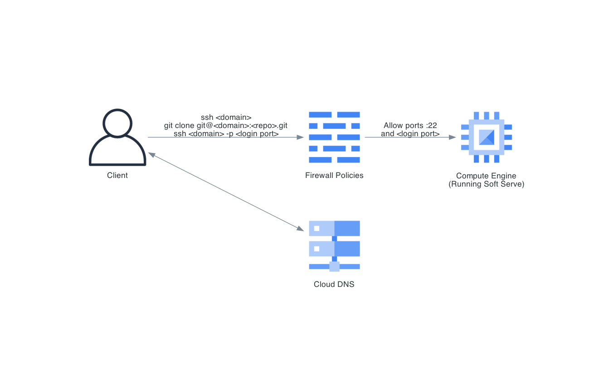

# [Soft Serve](https://github.com/charmbracelet/soft-serve) on Google Cloud

Set up a GCE vm instance running [Soft Serve](https://github.com/charmbracelet/soft-serve) by following [this guide](https://charm.sh/blog/self-hosted-soft-serve/) on the charm.sh blog
- Add an A DNS record to map your `<domain>` to the GCE vm external ip address
- Add a VPC firewall rule to enable SSHing into another port for login, since the default port will be configured to use Soft Serve

Follow [Git on the Server](https://git-scm.com/book/en/v2/Git-on-the-Server-Setting-Up-the-Server) to enable `git clone`
- A new `git` user needs to be created
- `git clone git@<domain>:<repo>.git` searches relative to the `git` user's home directory to locate `<repo>.git`
  - Not sure if there's another way, but the `git` user's home directory can be changed with `sudo usermod -d /var/local/lib/soft-serve/repos git`
